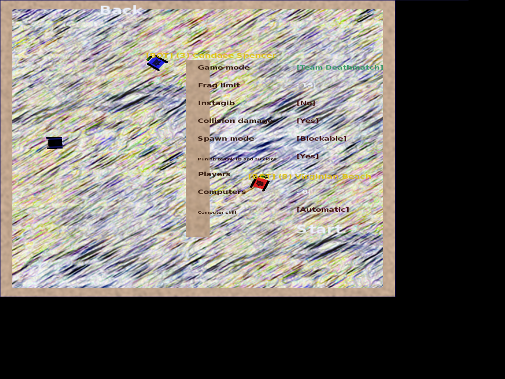
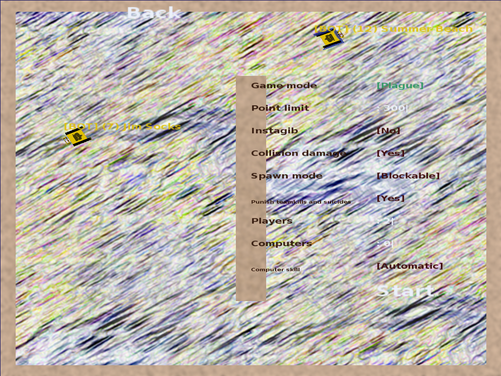

# Tankbobs (2008-2010)

Tankbobs is a cross-platform 2D shooter game licensed under the GPL.

Shoot other tanks to score points, race against mates and computer-controlled
players in a track with a variety of powerups, and capture the flag over the
'net to help your team win!

Features:
  * Online play
  * AI
  * Extensible scripting and mod support
  * Custom levels
  * Unlimited acceleration with speed-proportional rotation mode for
    effectively unlimited speed

# Screenshots

